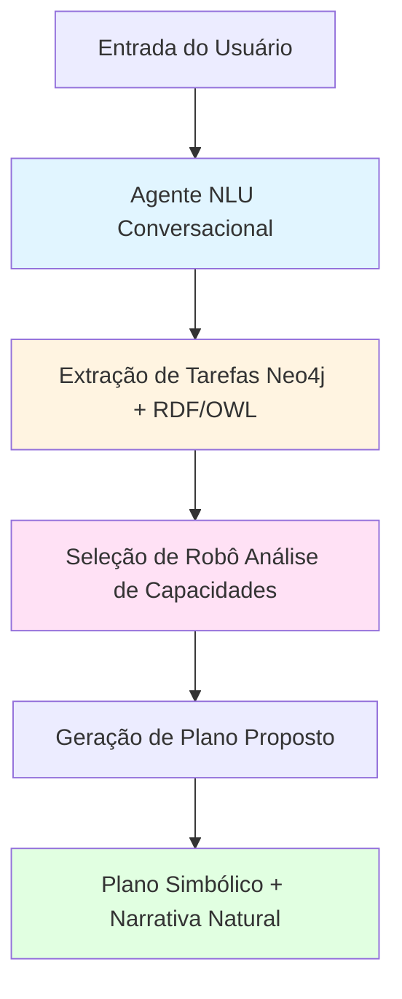

# MO656 - Introdução à Web Semântica
## Fase 3: Sistema Híbrido de Controle Robótico Multiagente

**Instituição:** Instituto de Computação - UNICAMP  
**Professor:** Dr. Julio Cesar dos Reis  
**Autor:** Ervin Alain Bolivar Huayhua 
**Data:** Outubro 2025

---

## Descrição do Projeto

Sistema híbrido que integra Neo4j (Cypher), RDF/OWL (SPARQL) e LLM conversacional para controle de robôs assistenciais em ambiente simulado (CoppeliaSim).

### Objetivo
Desenvolver um sistema capaz de:
- Interpretar comandos em linguagem natural
- Selecionar o robô mais adequado baseado em capacidades semânticas
- Gerar planos de execução e narrativas naturais

---

## Arquitetura do Sistema

## Componentes:

- Working Memory: Neo4j (informação dinâmica)
- Semantic Memory: RDF/OWL (ontologia de capacidades)
- NLU Agent: LLM Groq (interpretação de linguagem natural)
- Planner: Geração híbrida de planos

## Examplo de uso

```python

# Entrada do usuário
comando = "Pode me trazer uma maçã?"

# Sistema processa
result = processar_comando(comando)

# Saída
# Robô selecionado: RobotHumanoide
# Plano: [Navigate(Sala1→Sala2), PickUp(apple1), Navigate(Sala2→Sala1), Deliver(apple1, Ervin)]
# Narrativa: "Vou até a Sala2 pegar a maçã e trazer para você."
```
